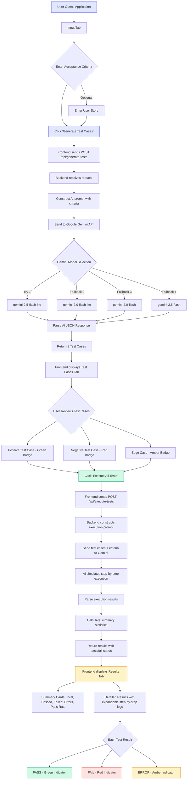

# AI Test Automation - Complete Guide

## Table of Contents

1. [Overview](#overview)
2. [Architecture](#architecture)
3. [Flow Diagram](#flow-diagram)
4. [Step-by-Step Setup Guide](#step-by-step-setup-guide)
5. [Usage Guide](#usage-guide)
6. [API Reference](#api-reference)
7. [Project Structure](#project-structure)
8. [Troubleshooting](#troubleshooting)

---

## Overview

AI Test Automation is a full-stack web application that leverages Google Gemini AI to automatically generate and execute test cases from user story acceptance criteria. It produces three types of test cases:

- **Positive Test Case**: Validates the happy path / expected behavior
- **Negative Test Case**: Tests error handling, invalid inputs, and boundary violations
- **Edge Case Test Case**: Tests unusual but valid scenarios and boundary conditions

The application supports **three execution modes**:

| Mode | Description | Requires URL? |
|------|-------------|---------------|
| **AI Simulation** | AI reasons about test outcomes based on acceptance criteria | No |
| **HTTP Testing** | Real HTTP requests (GET, POST, etc.) against a target URL via httpx | Yes |
| **Browser Testing** | Headless Chromium browser automation via Playwright | Yes |

---

## Architecture

```
+-------------------+         +--------------------+         +------------------+
|                   |  HTTP   |                    |   API   |                  |
|   React Frontend  | ------> |   FastAPI Backend   | ------> |  Google Gemini   |
|   (Vite + TS)     | <------ |   (Python)          | <------ |  AI Model        |
|                   |         |                    |         |                  |
+-------------------+         +--------------------+         +------------------+
     Port 5173                     Port 8000                   Cloud API
     (dev mode)                    (dev mode)
```

### Technology Stack

| Layer     | Technology                                      |
|-----------|--------------------------------------------------|
| Frontend  | React 19, TypeScript, Vite, Tailwind CSS, shadcn/ui |
| Backend   | Python 3.12, FastAPI, Pydantic, Poetry           |
| AI Engine | Google Gemini 2.5 Flash Lite (with fallback models) |
| HTTP Testing | httpx (async HTTP client)                     |
| Browser Testing | Playwright (headless Chromium)              |
| Deployment| Fly.io (backend), Devin Apps (frontend)          |

---

## Flow Diagram



---

## Step-by-Step Setup Guide

### Prerequisites

Before you begin, ensure you have the following installed:

| Requirement | Version | Check Command |
|-------------|---------|---------------|
| Node.js     | 18+     | `node --version` |
| npm         | 9+      | `npm --version` |
| Python      | 3.12+   | `python3 --version` |
| Poetry      | 1.7+    | `poetry --version` |
| Git         | 2.0+    | `git --version` |

You also need a **Google Gemini API Key** (free tier available):
- Visit https://aistudio.google.com/apikey
- Click "Create API Key"
- Copy the key for later use

### Step 1: Clone the Repository

```bash
git clone https://github.com/chanchaldutta344/ai-test-automation.git
cd ai-test-automation
```

### Step 2: Set Up the Backend

```bash
# Navigate to backend directory
cd test-automation-backend

# Create environment file with your Gemini API key
echo "GEMINI_API_KEY=your_api_key_here" > .env

# Install Python dependencies using Poetry
poetry install

# Install Playwright browsers (required for Browser Testing mode)
poetry run playwright install chromium

# Start the development server
poetry run fastapi dev app/main.py
```

The backend API will be available at **http://localhost:8000**

You can verify it's running by visiting http://localhost:8000/healthz - you should see:
```json
{"status": "ok"}
```

You can also explore the auto-generated API docs at http://localhost:8000/docs

### Step 3: Set Up the Frontend

Open a new terminal window:

```bash
# Navigate to frontend directory
cd test-automation-frontend

# Create environment file pointing to the backend
echo "VITE_API_URL=http://localhost:8000" > .env

# Install Node.js dependencies
npm install

# Start the development server
npm run dev
```

The frontend will be available at **http://localhost:5173**

### Step 4: Verify the Setup

1. Open your browser and navigate to http://localhost:5173
2. You should see the "AI Test Automation" interface with the Input tab
3. Enter some acceptance criteria (e.g., "User should be able to login with email and password")
4. Click "Generate Test Cases" - you should see 3 generated test cases
5. Click "Execute All Tests" - you should see execution results with pass/fail status

---

## Usage Guide

### Step 1: Enter Acceptance Criteria

On the **Input** tab:

1. **User Story (Optional)**: Enter the user story in the format: "As a [user], I want to [action], so that [benefit]"
2. **Acceptance Criteria (Required)**: Enter the detailed acceptance criteria. Tips for best results:
   - Use Given/When/Then format
   - Be specific about expected behaviors
   - Include both success and failure scenarios
   - Mention any constraints (e.g., character limits, validation rules)

**Example Input:**
```
Given a registered user with valid credentials
When they enter their email and password on the login page
Then they should be redirected to the dashboard
And a welcome message should be displayed with their name
If the email is not registered, show "Account not found" error
If the password is incorrect, show "Invalid password" error
Password must be at least 8 characters long
```

### Step 2: Generate Test Cases

Click the **"Generate Test Cases"** button. The AI will analyze your acceptance criteria and create:

| Test Type | Purpose | Badge Color |
|-----------|---------|-------------|
| Positive  | Happy path - validates expected behavior works correctly | Green |
| Negative  | Error handling - validates system handles invalid inputs | Red |
| Edge Case | Boundary conditions - validates unusual but valid scenarios | Amber |

Each test case includes:
- **Title**: Short descriptive name
- **Description**: What the test validates
- **Steps**: Ordered list of actions to perform
- **Expected Result**: What should happen when the test passes

### Step 3: Select Execution Mode

Before executing, choose an **Execution Mode**:

| Mode | When to Use | What Happens |
|------|-------------|-------------|
| **AI Simulation** | Requirements validation, early-stage testing | AI reasons about outcomes—no real requests made |
| **HTTP Testing** | API testing, endpoint validation | Real HTTP requests sent to a target URL |
| **Browser Testing** | E2E testing, UI verification | Headless Chromium navigates, clicks, fills forms |

For **HTTP** or **Browser** modes, enter the **Target URL** of the application you want to test (e.g., `https://httpbin.org` or `https://example.com`).

### Step 4: Execute Test Cases

Click **"Execute All Tests"**. Depending on the mode:

- **AI Simulation**: The AI simulates executing each test step by step and evaluates pass/fail based on the acceptance criteria.
- **HTTP Testing**: The AI generates an HTTP request plan, then the backend executes real HTTP requests against the target URL and reports actual status codes.
- **Browser Testing**: The AI generates a browser action plan (goto, click, fill, etc.), then Playwright executes those actions in a real headless Chromium browser.

### Step 5: Review Results

The **Results** tab shows:

- **Summary Dashboard**: Cards showing Total Tests, Passed, Failed, Errors, and Pass Rate
- **Detailed Results**: Expandable cards for each test with:
  - Overall status (PASS/FAIL/ERROR)
  - Actual result description
  - Detailed explanation
  - Step-by-step execution log with individual step status

---

## API Reference

### Health Check

```
GET /healthz
```

**Response:**
```json
{
  "status": "ok"
}
```

### Generate Test Cases

```
POST /api/generate-tests
Content-Type: application/json
```

**Request Body:**
```json
{
  "acceptance_criteria": "string (required)",
  "user_story": "string (optional)"
}
```

**Response:**
```json
{
  "test_cases": [
    {
      "id": 1,
      "type": "positive",
      "title": "Test case title",
      "description": "What this test validates",
      "steps": ["Step 1: ...", "Step 2: ..."],
      "expected_result": "Expected outcome"
    }
  ],
  "acceptance_criteria": "Original input"
}
```

### Execute Test Cases (AI Simulation)

```
POST /api/execute-tests
Content-Type: application/json
```

**Request Body:**
```json
{
  "test_cases": [/* array of test case objects */],
  "acceptance_criteria": "string"
}
```

**Response:**
```json
{
  "results": [...],
  "summary": { "total": 3, "passed": 2, "failed": 1, "errored": 0, "pass_rate": "66.7%" },
  "execution_mode": "ai_simulated"
}
```

### Execute Test Cases (HTTP Testing)

```
POST /api/execute-tests-http
Content-Type: application/json
```

**Request Body:**
```json
{
  "test_cases": [/* array of test case objects */],
  "acceptance_criteria": "string",
  "target_url": "https://httpbin.org"
}
```

**Response:**
```json
{
  "results": [...],
  "summary": { "total": 3, "passed": 2, "failed": 1, "errored": 0, "pass_rate": "66.7%" },
  "execution_mode": "http"
}
```

### Execute Test Cases (Browser Testing)

```
POST /api/execute-tests-browser
Content-Type: application/json
```

**Request Body:**
```json
{
  "test_cases": [/* array of test case objects */],
  "acceptance_criteria": "string",
  "target_url": "https://example.com"
}
```

**Response:**
```json
{
  "results": [...],
  "summary": { "total": 3, "passed": 2, "failed": 1, "errored": 0, "pass_rate": "66.7%" },
  "execution_mode": "browser"
}
```

---

## Project Structure

```
ai-test-automation/
|
+-- README.md                          # Project overview
+-- docs/
|   +-- GUIDE.md                       # This guide
|   +-- flow-diagram.png               # Visual flow diagram
|
+-- test-automation-backend/           # Python FastAPI Backend
|   +-- app/
|   |   +-- __init__.py
|   |   +-- main.py                    # API endpoints & AI integration
|   +-- .env                           # Environment variables (not committed)
|   +-- pyproject.toml                 # Python dependencies
|   +-- poetry.lock                    # Lock file
|
+-- test-automation-frontend/          # React TypeScript Frontend
    +-- src/
    |   +-- App.tsx                    # Main application component
    |   +-- main.tsx                   # Entry point
    |   +-- index.css                  # Global styles (Tailwind)
    |   +-- components/
    |       +-- ui/                    # shadcn/ui components
    |           +-- button.tsx
    |           +-- card.tsx
    |           +-- input.tsx
    |           +-- textarea.tsx
    |           +-- badge.tsx
    |           +-- separator.tsx
    |           +-- tabs.tsx
    +-- .env                           # Environment variables (not committed)
    +-- package.json                   # Node dependencies
    +-- vite.config.ts                 # Vite configuration
    +-- tailwind.config.js             # Tailwind CSS configuration
    +-- tsconfig.json                  # TypeScript configuration
```

---

## Troubleshooting

### Common Issues

| Issue | Solution |
|-------|----------|
| "GEMINI_API_KEY not configured" | Ensure `.env` file exists in `test-automation-backend/` with your key |
| API quota exceeded (429 error) | Wait for quota reset or upgrade your Gemini API plan |
| Frontend can't connect to backend | Check that backend is running on port 8000 and `.env` has correct `VITE_API_URL` |
| CORS errors in browser | The backend has CORS configured to allow all origins - restart the backend |
| "Failed to parse AI response" | Retry the request - occasionally AI responses may not be valid JSON |
| Playwright not installed | Run `poetry run playwright install chromium` in the backend directory |
| Browser testing timeout | The target site may be slow; try a simpler URL like `https://example.com` |
| Poetry not found | Install Poetry: `curl -sSL https://install.python-poetry.org | python3 -` |

### Getting a Free Gemini API Key

1. Go to https://aistudio.google.com/apikey
2. Sign in with your Google account
3. Click "Create API Key"
4. Select or create a Google Cloud project
5. Copy the generated key
6. Add it to your `.env` file: `GEMINI_API_KEY=your_key_here`

### Supported Gemini Models

The application automatically tries multiple models with fallback:

1. `gemini-2.5-flash-lite` (fastest, most available)
2. `gemini-2.0-flash-lite` (fallback)
3. `gemini-2.0-flash` (fallback)
4. `gemini-2.5-flash` (most capable, fallback)

If one model's quota is exhausted, the system automatically tries the next model.
